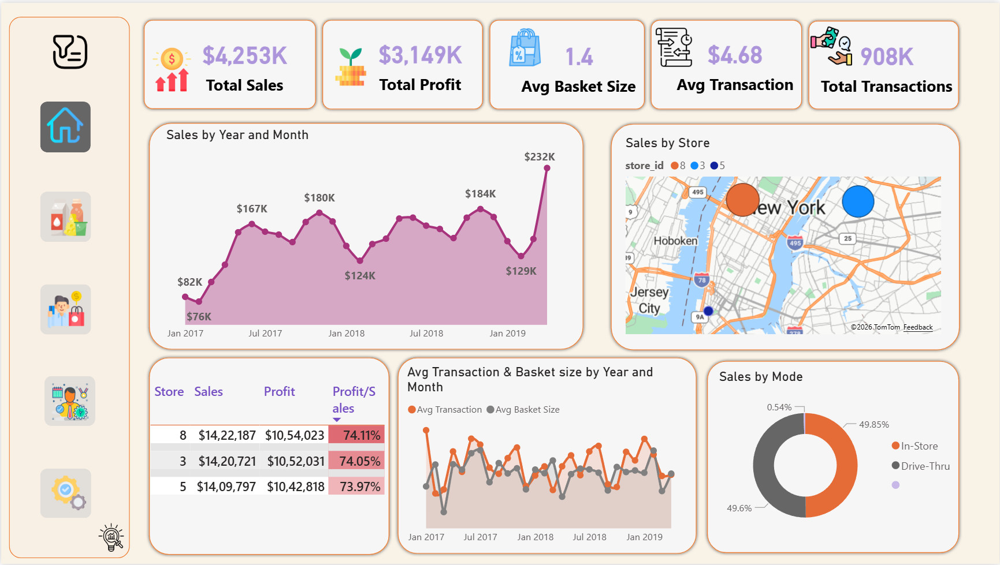
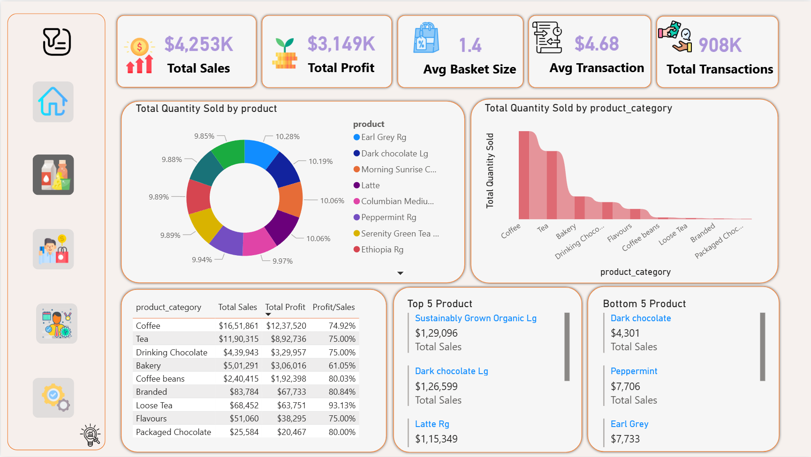
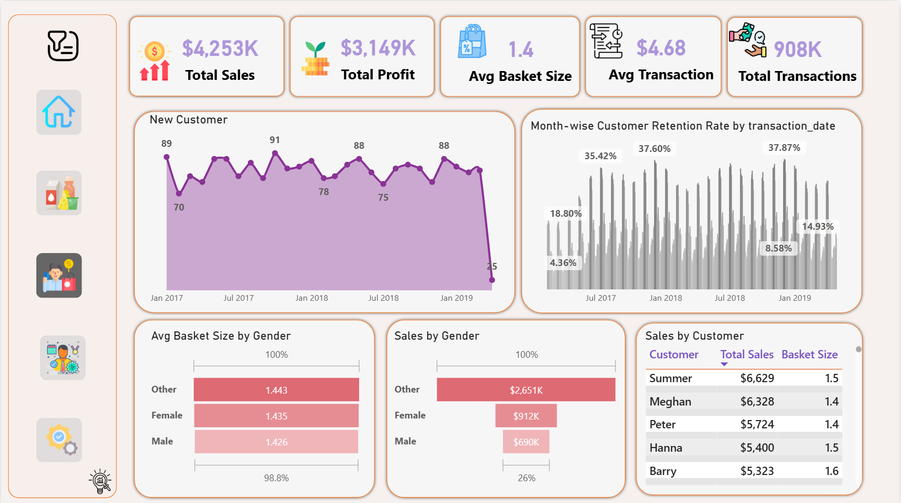
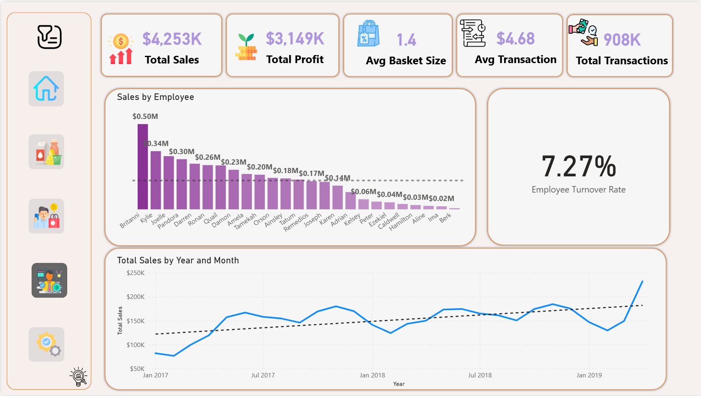
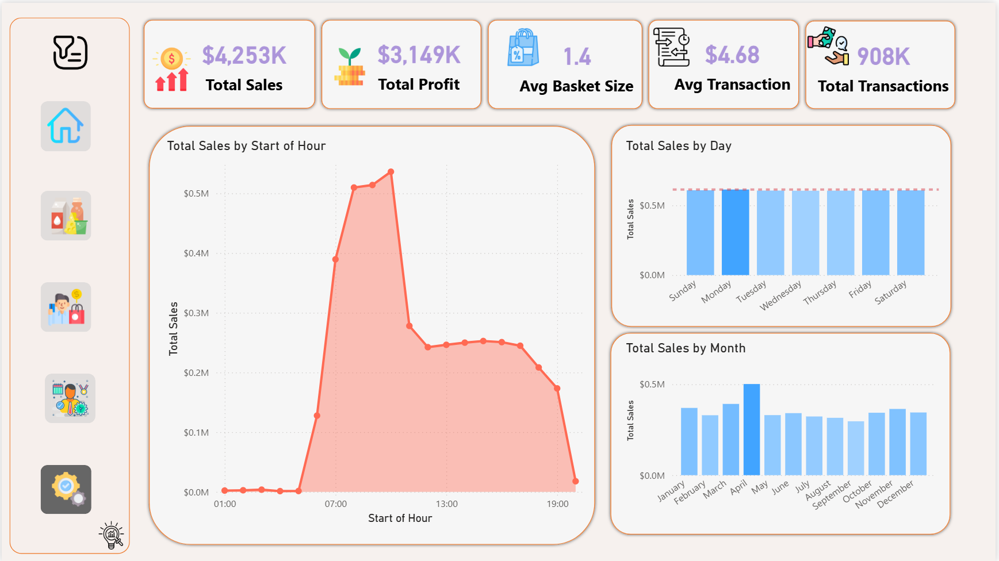
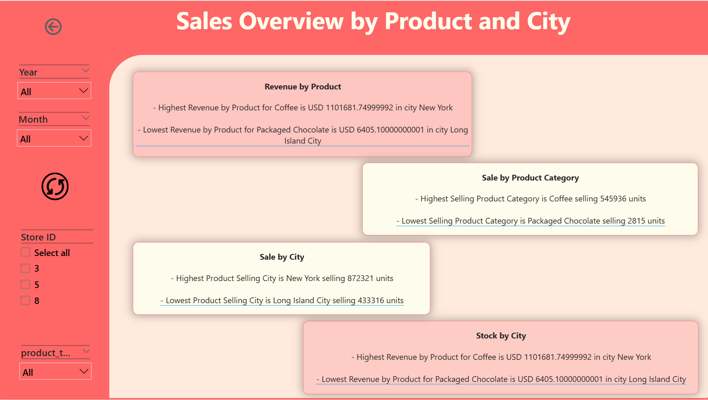

# Store Sales Analytics

A Power BI dashboard project providing comprehensive insights into retail store performance across multiple locations in the US. Developed as part of the B.Tech Software Project Major (IT447) at CHARUSAT, in collaboration with AtliQ Technologies.

**Institution:** Devang Patel Institute of Advance Technology and Research (DEPSTAR), CHARUSAT  
**Course:** IT447 - Software Project Major | 8th Semester  
**Author:** Malav Patel (20DIT059)  
**Supervisor:** Prof. Chintal Raval | Mr. Karandeep Singh Grover (CEO, AtliQ Technologies)

---

## Project Overview

The Store Sales Analytics project analyses retail sales data across different US cities to provide store managers with actionable, data-driven insights. The dashboard covers sales performance, customer behaviour, product trends, employee metrics, and operational patterns — all in a single interactive Power BI report.

The project follows a complete data analytics lifecycle: from raw data import and SQL-based processing, through data cleaning and DAX measure development in Power BI, to a fully interactive multi-page dashboard.

---

## Key Metrics

| Metric | Value |
|---|---|
| Total Sales | $4,253K |
| Total Profit | $3,149K |
| Average Basket Size | 1.4 items |
| Average Transaction Value | $4.68 |
| Total Transactions | 908K |
| Employee Turnover Rate | 7.27% |

---

## Dashboard Pages

### Home Page
High-level overview of store performance including total sales, profit, average basket size, average transaction value, and total transactions. Includes a map of sales by store location, sales trend over time, sales by mode (In-store vs. Drive-Thru), and a store-level profit margin table.



---

### Product Page
Product-level analysis including top 5 and bottom 5 products by sales, total quantity sold by product and category, and a category-level sales, profit, and profit margin table.

- Top product: Sustainably Grown Organic Lg — $1,29,096
- Bottom product: Dark Chocolate — $4,301
- Highest category by sales: Coffee — $16,51,861 (74.92% margin)



---

### Customer Page
Insights into customer behaviour including new customers by month, month-wise customer retention rate, sales and basket size by customer, and sales broken down by gender.

- Top customer by sales: Summer — $6,629
- Sales by gender: Other $2,651K | Female $912K | Male $690K



---

### Employee Page
Workforce analytics including employee turnover ratio (7.27%), sales performance by individual employee, and total sales trends over time.

- Top employee by sales: Britanni — $0.50M
- Overall upward sales trend from Jan 2017 to Jan 2019



---

### Operation Page
Store operational patterns including total sales by hour of day, by day of week, and by month — helping optimize staffing and promotional strategies.

- Peak sales hour: 07:00–13:00
- Peak sales month: May ($0.5M)
- Sales are relatively consistent across all weekdays



---

### Sales Overview by Product and City
AI-powered smart narrative page summarizing key insights across product, category, and city dimensions with dynamic text cards.

- Highest revenue product: Coffee in New York — $1,101,681
- Highest selling city: New York — 872,321 units
- Lowest selling city: Long Island City — 433,316 units



---

## Tools and Technologies

| Category | Technology |
|---|---|
| Database | MySQL Workbench 8.0 CE |
| Data Processing | SQL (queries, joins, stored procedures) |
| Dashboard | Microsoft Power BI Desktop |
| DAX | Data Analysis Expressions (calculated measures and columns) |
| Data Transformation | Power Query (within Power BI) |
| Report | Microsoft Word |

---

## System Flow

```
MySQL Database
     │
     ├── Raw Data Import
     │
     ├── SQL Queries
     │        │
     │        └── Create Report / Verify Data
     │
Power BI
     │
     ├── Data Cleaning (Power Query)
     │
     ├── Data Processing
     │
     ├── DAX Measures
     │
     └── Data Visualization (Dashboard)
```

---

## Data Verification

All DAX measures were verified against SQL queries executed directly on the MySQL database. The verification process included:

- Executing SQL queries to retrieve the same aggregations shown in the dashboard
- Visual comparison of SQL outputs with dashboard visuals
- Validation of calculations including total sales, profit margins, retention rates, and turnover ratios

---

## Repository Structure

```
Store-Sales-Analytics/
│
├── README.md
├── Store_Sales.pbix              ← Interactive Power BI dashboard
│
├── dashboard/
│   ├── 01_Home.png               ← Home page screenshot
│   ├── 02_Product.png            ← Product page screenshot
│   ├── 03_Customer.png           ← Customer page screenshot
│   ├── 04_Employee.png           ← Employee page screenshot
│   ├── 05_Operation.png          ← Operation page screenshot
│   └── 06_Sales_Overview.png     ← Sales overview page screenshot
│
└── docs/
    └── Project_Report.pdf        ← Full B.Tech project report
```

---

## How to Open the Dashboard

1. Download and install [Power BI Desktop](https://powerbi.microsoft.com/desktop/) (free)
2. Clone or download this repository
3. Open `Store_Sales.pbix` in Power BI Desktop
4. Use the navigation bar on the left to switch between dashboard pages
5. Use the filter panel (top-left filter icon) to apply Year, Month, Store, or Product filters

---

## License

This project was developed for academic purposes as part of the B.Tech program at CHARUSAT in collaboration with AtliQ Technologies. All data used is proprietary to AtliQ Technologies.
